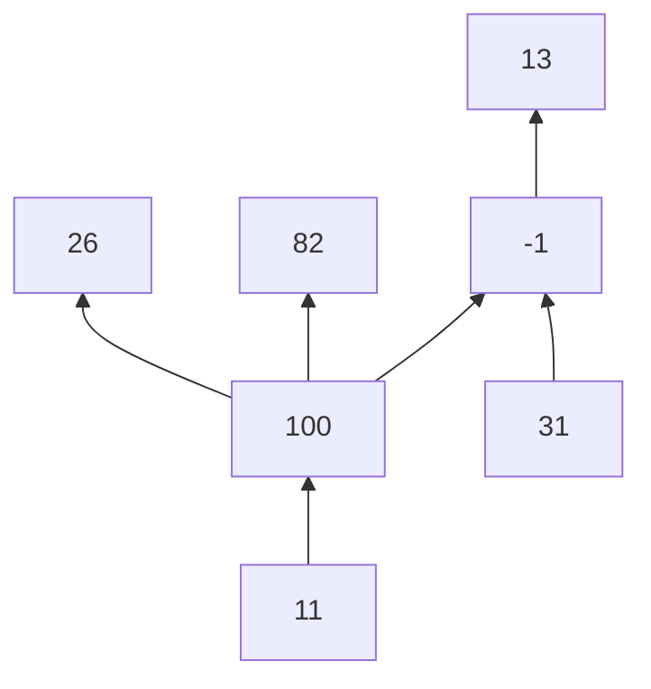
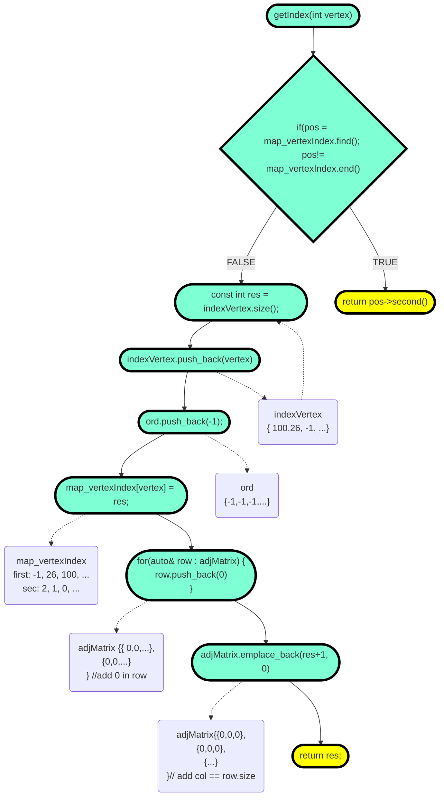

# My_Graph

```mermaid
flowchart BT
11 --> 100 --> 26
100 --> 82
100 --> -1
-1 --> 13
31 --> -1
```

```mermaid
flowchart TD
  classDef class1 fill:#7FFFD4, stroke:#000, stroke-width:4px
   classDef class2 fill: #FFFF00, stroke:#000, stroke-width:4px
    A(["getIndex(int vertex)"]):::class1
    B{"if(pos = map_vertexIndex.find(); \n pos!= map_vertexIndex.end()"}:::class1
     Vertexindex("map_vertexIndex \n  first: -1, 26, 100, ... \nsec:  2, 1, 0, ... ")
    IndexVertex("indexVertex \n { 100,26, -1,  ...}")
    Ord("ord \n {-1,-1,-1,...}")
    For(["for(auto& row : adjMatrix) { \n row.push_back(0) \n }" ]):::class1
    A-->B
    B--FALSE-->E(["const int res = indexVertex.size();"]):::class1
    E --> F(["indexVertex.push_back(vertex)"]):::class1
    F--> G(["ord.push_back(-1);"]):::class1
    G --> H(["map_vertexIndex[vertex] = res;"]):::class1
     H -.-> Vertexindex
    F -.-> IndexVertex
    IndexVertex -.-> E
    G -.-> Ord
   
    B--TRUE-->D(["return pos->second()"]):::class2

    H--> For -.-> J("adjMatrix {{ 0,0,...}, \n {0,0,...} \n } //add 0 in row")
    For --> K(["adjMatrix.emplace_back(res+1, 0)"]):::class1 -.-> M("adjMatrix{{0,0,0}, \n {0,0,0},\n{...} \n }// add col == row.size ")
    K --> R(["return res;"]):::class2
    
```
