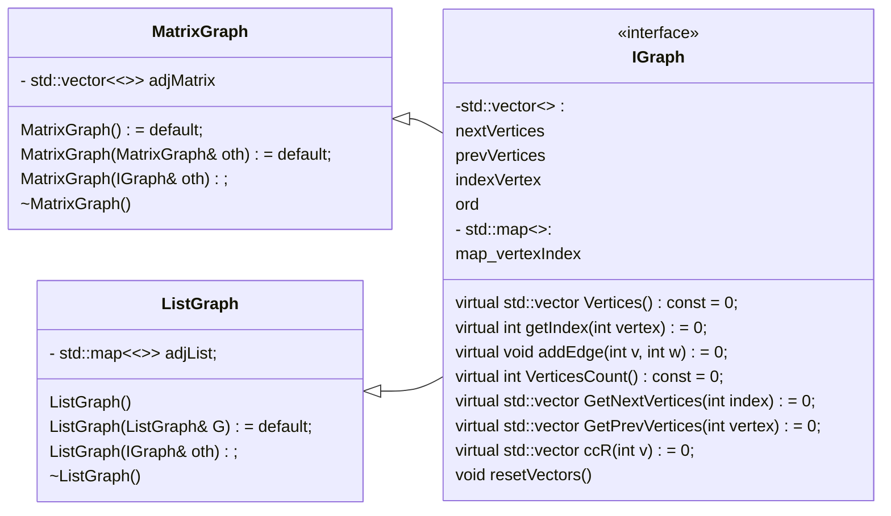
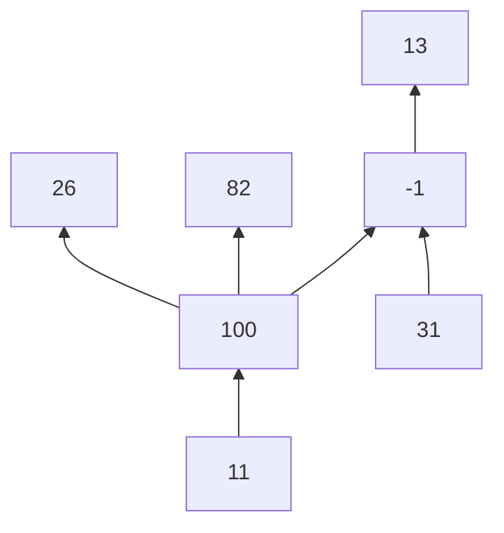
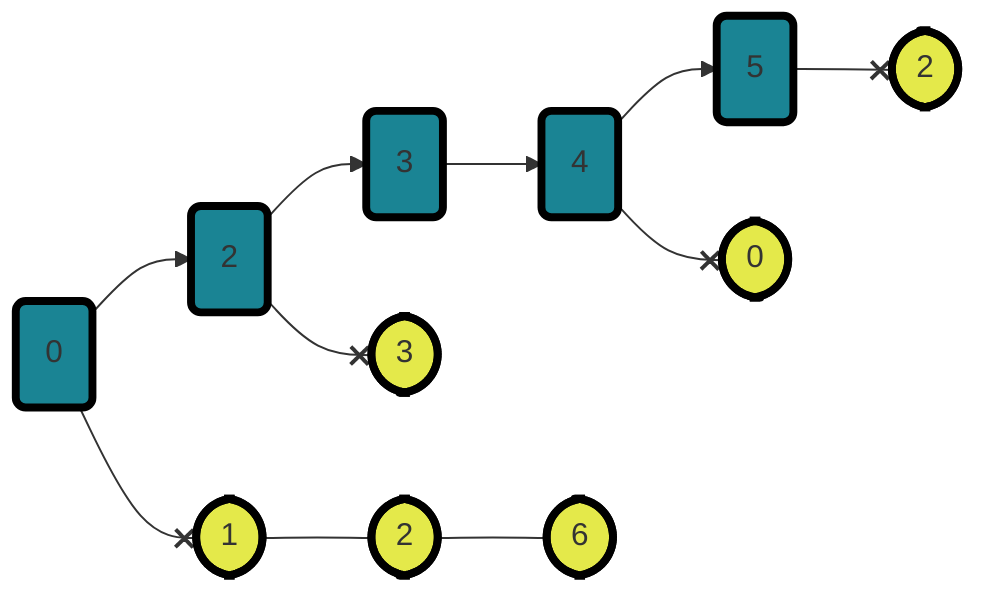
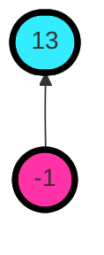
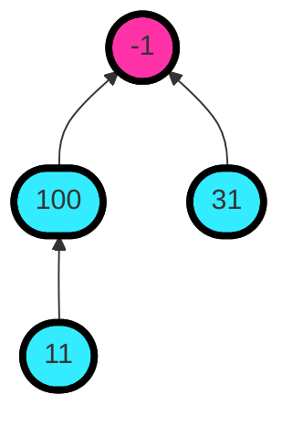

<h1 align = "center">My_Graph </h1> 

---



## Einstellung
- OS WINDOWS
- CMake 3.8
- C++17
-  Compiller MSVC

## beschreibung des Codes
<br> __MatrixGraph__<br>
stellt einen Graph auf der Adjazenzmatrix dar
- __int getIndex(int vertex) override__
- gibt den Index des Stützpunkts zurück

  ---

```mermaid
flowchart TD
   classDef class1 fill:#7FFFD4, stroke:#000, stroke-width:4px
   classDef class2 fill: #FFFF00, stroke:#000, stroke-width:4px
   classDef class3 fill: #33ff33, stroke:#000, stroke-width:4px
   classDef class4 fill: #B2ff66, stroke:#000, stroke-width:4px
    A(["getIndex(int vertex)"]):::class1
    B{{"if(pos = map_vertexIndex.find(); \n pos!= map_vertexIndex.end()"}}:::class3
     Vertexindex("map_vertexIndex \n  first: -1, 26, 100, ... \nsec:  2, 1, 0, ... ")
    IndexVertex("indexVertex \n { 100,26, -1,  ...}")
    Ord("ord \n {false,false,false,...}")
    For(["for(auto& row : adjMatrix) { \n row.push_back(0) \n }" ]):::class4
    A-->B
    B--FALSE-->E(["const int res = indexVertex.size();"]):::class1
    E --> F(["indexVertex.push_back(vertex)"]):::class1
    F--> G(["ord.push_back(false);"]):::class1
    G --> H(["map_vertexIndex[vertex] = res;"]):::class1
     H -.-> Vertexindex
    F -.-> IndexVertex
    IndexVertex -.-> E
    G -.-> Ord
   
    B--TRUE-->D(["return pos->second()"]):::class2

    H--> For --add 0 in row-.-> J("adjMatrix {{ 0,0,...}, \n {0,0,...}, \n {...} \n }" )
    For --> K(["adjMatrix.emplace_back(res+1, 0)"]):::class1 -- add col == row.size -.->J
    K --> R(["return res;"]):::class2
  ```

__std::vector<int> GetNextVertices(int index) override;__

---


```mermaid
  flowchart TD
   classDef class1 fill:#7FFFD4, stroke:#000, stroke-width:4px
   classDef class2 fill: #FFFF00, stroke:#000, stroke-width:4px
   classDef class3 fill: #33ff33, stroke:#000, stroke-width:4px
   classDef class4 fill: #B2ff66, stroke:#000, stroke-width:4px
A(["GetNextVertices(int vertexIndex)"]):::class1
B(["ord[vertexIndex] = true;"]):::class1
C([" for (int i = 0; i < indexVertex.size(); i++)"]):::class4
D{{"if (adjMatrix[vertexIndex][i] == true) "}}:::class3
E([" nextVertices.push_back(indexVertex[i]);"]):::class1
F{{" if (ord[i] == false) GetNextVertices(i); "}}:::class3
A-->B-->C-->D
D--TRUE-->E -->F
D--FALSE-->C
F -- TRUE -->C
F --FALSE -->A
C -- "if(i == indexVertex.size())"-->G(["return nextVertices;"]):::class2
K("markieren diesen Index als überprüft") -.-> B
J("wenn dieser Index noch nicht überprüft wurde, \n kehren zurück gehe zu Zeile [i] \n  mit der Nummer des ungeprüften Scheitelpunkts") -.->F
D -.-> M("wenn es eine Kante gibt, \n die den Scheitelpunkt mit dem gewünschten Scheitelpunkt verbindet \n, speichern  diesen Scheitelpunkt") -.->E
N("überprüfen der Spalten in der Zeile \n mit der Nummer dieses Scheitelpunkts \n (vertexindex)") -.-> C
```

<br>__ListGraph__<br> 
 stellt einen Graph auf der Adjazenzliste dar
 - in der Datei main.cpp wird durch einen Graphen dargestellt



---

- alle Eckpunktdaten werden in  **std::map<int, std::unordered_set<<int>>>** adjList gespeichert



---

__std::vector<int> GetNextVertices(-1)__
- gibt zurück:




---

__std::vector<int> GetPrevVertices(-1)__
- gibt zurück:


